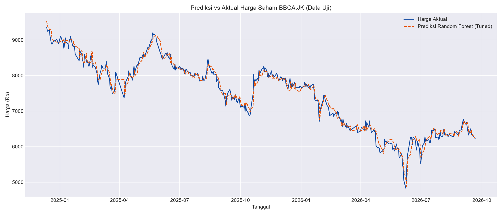

# 📈 BCA Stock Predictor — Prediksi Harga Saham BBCA dengan Machine Learning (Python + Streamlit)

Proyek portofolio *data science* untuk memprediksi harga saham **PT Bank Central Asia Tbk (BBCA)** menggunakan data historis dari **Yahoo Finance**, dengan pendekatan Machine Learning.


## 📝 Deskripsi

Notebook ini menganalisis data harga saham historis BBCA sejak 2015, membangun beberapa model prediksi (Linear Regression dan Random Forest yang di-*tuning*), lalu membandingkan performanya untuk memprediksi harga penutupan (*closing price*) saham beberapa hari ke depan.

> 💡 **Catatan versi:** Proyek ini sengaja **tidak memakai TensorFlow/LSTM** agar tetap bisa dijalankan di Python versi terbaru (termasuk Python 3.13/3.14), karena TensorFlow tidak selalu langsung tersedia untuk rilis Python paling baru. Model utamanya adalah **Random Forest** yang sudah di-tuning dengan `GridSearchCV`. Kalau kamu pakai Python 3.9–3.12, silakan tambahkan model LSTM sendiri sebagai pengembangan lanjutan (lihat bagian "Rencana Pengembangan").

> ⚠️ **Disclaimer:** Proyek ini dibuat untuk tujuan edukasi dan portofolio. Hasil prediksi **bukan** rekomendasi investasi atau trading. Selalu lakukan riset mandiri (DYOR) sebelum mengambil keputusan finansial.

## 🗂️ Struktur Proyek

```
bca-stock-prediction/
├── notebooks/
│   └── BCA_Stock_Prediction.ipynb   # Notebook utama
├── app.py                            # Dashboard interaktif Streamlit
├── data/                             # Data hasil download (di-generate otomatis)
├── models/                           # Model tersimpan (di-generate otomatis)
├── images/                           # Grafik hasil analisis (di-generate otomatis)
├── requirements.txt                  # Daftar dependensi Python
├── .gitignore
└── README.md
```

## 🛠️ Tech Stack

| Kategori         | Tools/Library                          |
|------------------|-----------------------------------------|
| Bahasa           | Python 3.10+                            |
| Editor           | Visual Studio Code (dengan ekstensi Jupyter) |
| Notebook         | Jupyter Notebook / JupyterLab           |
| Sumber data      | [Yahoo Finance](https://finance.yahoo.com/) via `yfinance` |
| Pengolahan data  | `pandas`, `numpy`                       |
| Visualisasi      | `matplotlib`, `seaborn`                 |
| Machine Learning | `scikit-learn` (Linear Regression, Random Forest + GridSearchCV) |
| Version Control  | Git & GitHub                            |

## 🚀 Cara Menjalankan (di VS Code)

1. **Clone repository ini**
   ```bash
   https://github.com/techrick-rgb/BCA-Stock-Predictor.git
   cd bca-stock-prediction
   ```

2. **Buat virtual environment** (disarankan)
   ```bash
   python -m venv venv
   # Windows
   venv\Scripts\activate
   # macOS/Linux
   source venv/bin/activate
   ```

3. **Install dependensi**
   ```bash
   pip install -r requirements.txt
   ```

4. **Buka folder ini di VS Code**
   ```bash
   code .
   ```
   Pastikan ekstensi **Python** dan **Jupyter** sudah terpasang di VS Code.

5. **Jalankan notebook**
   - Buka `notebooks/BCA_Stock_Prediction.ipynb`
   - Pilih kernel Python (virtual environment yang sudah dibuat)
   - Jalankan cell secara berurutan (`Run All`)

   Notebook akan otomatis mengunduh data terbaru saham BBCA dari Yahoo Finance saat dijalankan (butuh koneksi internet).

## 🖥️ Dashboard Interaktif (Streamlit)

Selain notebook, tersedia juga dashboard interaktif berbasis **Streamlit** (`app.py`) yang membungkus pipeline yang sama (ambil data → feature engineering → Random Forest → prediksi) jadi aplikasi web lokal yang bisa diklik-klik, tanpa perlu buka notebook.

Fitur dashboard:
- Atur tanggal mulai data historis & jumlah hari prediksi lewat sidebar
- Grafik interaktif harga + moving average (Plotly, bisa di-zoom/hover)
- Metrik evaluasi model (RMSE, MAE, MAPE, R²) real-time
- Grafik prediksi vs aktual pada data uji
- Feature importance
- Prediksi harga N hari ke depan + tombol download hasil sebagai CSV

**Cara menjalankan:**
```bash
# pastikan virtual environment aktif dan requirements.txt sudah ter-install
streamlit run app.py
```
Browser akan otomatis terbuka ke `http://localhost:8501`. Klik tombol **"Jalankan / Perbarui Analisis"** di sidebar untuk memulai.

> 💡 Tips: matikan opsi "Tuning hyperparameter" di sidebar kalau ingin hasil lebih cepat saat sedang bereksperimen — nyalakan lagi kalau ingin hasil model paling akurat.

## 📊 Alur Analisis

1. **Pengambilan Data** — Download data historis BBCA.JK via `yfinance`
2. **EDA (Exploratory Data Analysis)** — Statistik deskriptif, tren harga, volume perdagangan
3. **Feature Engineering** — Moving Average (MA7/30/90), RSI, volatilitas, lag features
4. **Split Data** — Time-based split (tidak diacak, sesuai kaidah data deret waktu)
5. **Pemodelan** — Linear Regression (baseline), Random Forest
6. **Tuning** — `GridSearchCV` dengan `TimeSeriesSplit` untuk mencari hyperparameter Random Forest terbaik
7. **Evaluasi** — RMSE, MAE, MAPE, R², serta feature importance
8. **Visualisasi** — Prediksi vs harga aktual
9. **Prediksi masa depan** — Estimasi harga 7 hari ke depan secara rekursif

## 📈 Contoh Hasil

*(Akan terisi otomatis di folder `images/` setelah notebook dijalankan — Anda dapat menambahkan cuplikan grafik di sini setelah menjalankan notebook, misalnya:)*

```markdown

```

## 📄 Lisensi

Proyek ini menggunakan lisensi [MIT](LICENSE) — bebas digunakan untuk pembelajaran dan pengembangan lebih lanjut.

## 🙋 Kontak

Dibuat sebagai proyek portofolio data science. Silakan buka *issue* atau *pull request* jika ada saran perbaikan.
